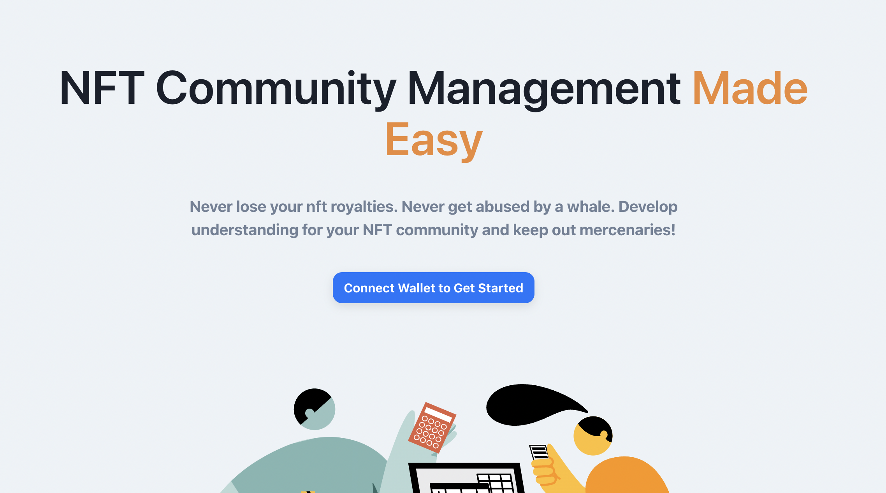

# Chiro Protect

Did you know for most NFT collections, NFT Royalties aren't actually enforceable and there's no way to ensure that NFT holders are real people?! Chira Protect is here to resolve these and more issues with the mission of giving power back to NFT creators and their communities.

## Live Demo

### Admin (for creators)
https://chiro-protect.vercel.app/

### Verifier (for holders)
https://verifier-chiro-protect.vercel.app/

## Deployed Contracts

### Onchain zkProof Registory
https://mumbai.polygonscan.com/address/0x83Be1C969B4CDDc1b54eFBb28177Cb3a83A14D88

#### setup
https://mumbai.polygonscan.com/tx/0xb427dd8c605b40cdd284ccb20427fc53948fe1f7e1aa33e22ab25f9b76a7573a

#### Sending world id proof
https://mumbai.polygonscan.com/tx/0xee7cd38c3b6d263922fccc0b4b00d96a4be0da38ae6010c91675bccf8a9d6ae8

#### Sending polygon id proof
https://mumbai.polygonscan.com/tx/0xf3ab04707c95f23db7d88607eb913b6fcf498613498644d8df29f210f493df61

### Protected NFT
https://mumbai.polygonscan.com/address/0x83Be1C969B4CDDc1b54eFBb28177Cb3a83A14D88

** not able to verify in Etherscan due to some issue.

## How it works

### Smart Contract

1. New NFT standard for the protected ERC721
2. protected ERC721 can control protocol and distribution to NFT holders
For NFT holders, Onchain zkProof verification is used to check the user has a certain type of credential

For Onchain proof verification, we integrated the following zkProof-based technology

#### Polygon Id

- Verification Contract
  - https://github.com/Ruborcalor/protect/blob/main/contracts/contracts/VerificationResistory.sol#L87

- Verification Frontend
  - https://github.com/Ruborcalor/protect/blob/main/verifier/src/pages/%5BipfsHash%5D.tsx#L134
  
This is a credential that is used in the demo
  - https://platform-test.polygonid.com/claim-link/d172aa65-f661-4a5e-9ece-3577ceae9b93

#### World ID

- Verification Contract
  - https://github.com/Ruborcalor/protect/blob/main/contracts/contracts/lib/WorldIDVerifier.sol#L47

- Verification Frontend 
  - https://github.com/Ruborcalor/protect/blob/main/verifier/src/pages/%5BipfsHash%5D.tsx#L98

### Other technology

#### IPFS

We put the required credential information in IPFS and the URI with IPFS hash is shared with users to access the verify page. By IPFS, we can easily build data sharing in a verifiable way.

- upload data here
  - https://github.com/Ruborcalor/protect/blob/main/src/pages/protect-new-collection.tsx#L417